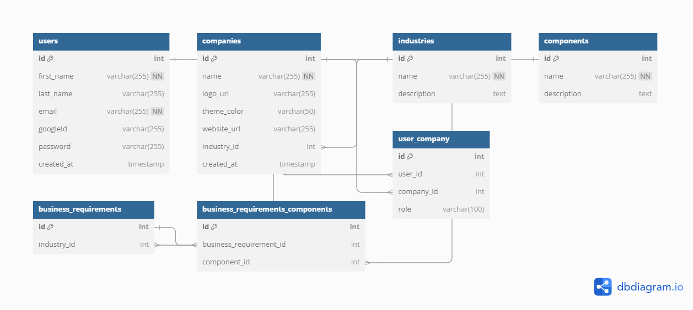

Users & Companies have a many-to-many relationship, so there is a user_company because companies have many users and users can belong to many companies
companies belong to industries, so there is an industry_id in the companies table as a foreign key
business requirements are related to industries so there is also an industry_id in the business requirements table
since components are related to business requirements there is also a business_requirements_components junction table

